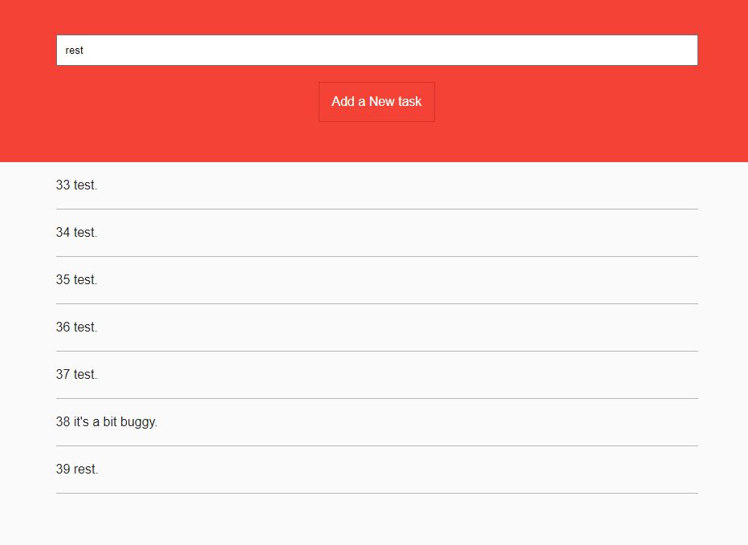

# FullStack-Task-Manager-With-sqlite3

This project is another task manager, this time more complex and visual as it does not run in the terminal but on a local machine.
To run it on your machine, start by cloning the repo with:
```bash
git clone git@github.com:DijiOfficial/FullStack-Task-Manager-With-sqlite3.git
```
Move into the repo and download the dependencies with:
```bash
npm install
```
And run it using: 
```bash
npm start
```
Finally you can check it out on http://localhost:3000 !

The application is a bit buggy and doesn't register/refresh properly after creating or deleting tasks. (manual reloads may fix it).

To stop the application simply press "Ctrl + C" in the terminal.



